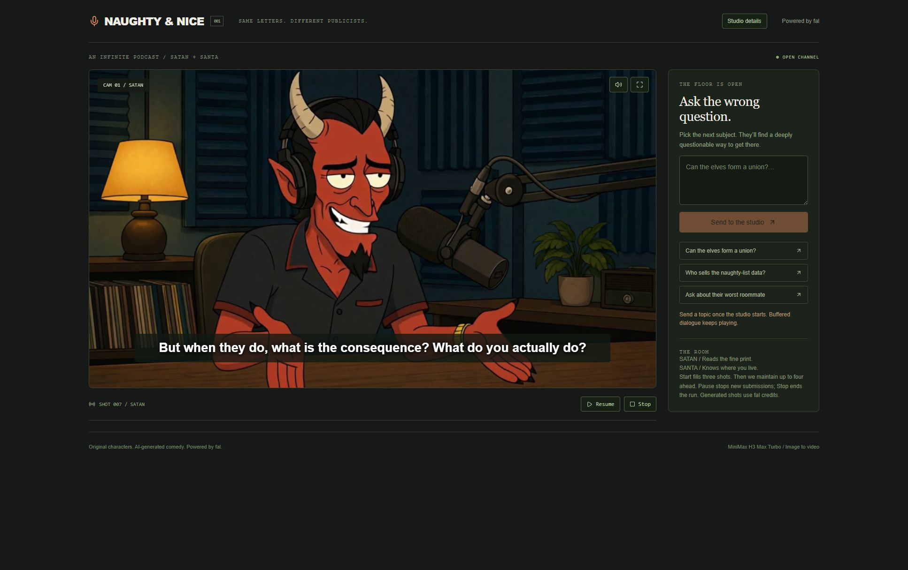

# Pepe & Chad Live

An infinite crypto-meme podcast that reacts to the timeline, to its own coin, and to the people watching. Pepe and GigaChad keep talking, pull in what is happening right now on X, celebrate and mourn the FROGCLENCH chart, answer the pump.fun stream chat by name, and give the very next exchange to whoever pays five dollars of the coin for it.

Built with [fal](https://fal.ai): MiniMax H3 Max Turbo generates each speaking shot from a character image, while Gemini writes the next exchange. Topics come from four lanes: free Google News RSS for tech and macro stories, the local [Grok CLI](https://x.ai) for what crypto voices are posting on X, the coin's own chart on pump.fun, and the pump.fun live chat.



## Continuous Director mode

Open [the Director console](http://127.0.0.1:3212/studio/director) and select **Start Director**. It targets one-hour sessions, prepares a replacement 90 seconds early, retains the replacement's opening in a playback buffer, and switches audio exclusively during a quiet reaction when possible. A shorter limit reported by fal takes precedence. `DIRECTOR_SESSION_SECONDS` defaults to `3600` in the local environment.

For OBS use `http://127.0.0.1:3212/studio/director?broadcast=1&autostart=1`. Keep the local producer running and stop the standard studio before switching modes. Director uses fal credits, including overlap. Stop closes both sessions; restarts wait for cleanup. The deployed public site still receives the existing OBS/Cloudflare output.

This mode is experimental: generated live speech does not use the standard clip transcription gate, and paid requests remain in the standard studio. A short live test successfully overlapped two sessions and measured a 16 ms handover; no full-day media soak has been performed. See the [Director rotation audit](docs/audits/2026-09-09-director-rotation.md) for evidence, recovery behavior and limits.

## How it works

- Two fixed camera angles, generated speech, and 10–11 second shots; short lines leave time for natural listening.
- The subject changes roughly every 35 seconds: some takes get one quick exchange, some get two, so the rhythm varies.
- The crypto desk searches X for what named memecoin and Solana accounts are posting, and the hosts riff on their takes.
- The free news lane focuses on Solana, memecoins and crypto events. Search stories require matching coverage from two outlets. Dated, sourced community history in `lib/stories.ts` fills quieter periods; covered stories are skipped. The hosts keep real events central to the conversation and distinguish historical recollections from live reporting.
- The chart lane watches the show's own coin: a big move, a new high, a graduation milestone or a dead-flat ten minutes becomes a bit, always chased by a not-financial-advice joke.
- The pump.fun live chat is read in real time, ranked locally, and the hosts answer the funniest viewers by name before telling them to buy the coin (not financial advice).
- Viewers on the public site pay five dollars of the coin to put a 240-character message into the very next exchange. Paid requests are first in line and are never dropped. There is no free input.
- 40 seconds of decoded, ordered footage before playback; a 60-second preparation target, with three render pipelines at once.
- Pause, resume, fullscreen, captions, an optional studio details panel, and a clean broadcast view for OBS.

## Two pages

- `/` is the **public site**: the live stream, the coin card, the five-dollar seat and the list of recent paid requests. It is what viewers open.
- `/studio` is the **producer console**: the engine, the buffer, the chat panel and the paid-request queue. Exactly one studio tab may run at a time; a second one spends fal credits twice.
- `/studio?broadcast=1&autostart=1` is the **broadcast view**: no chrome, the stage filling a 16:9 viewport with the lower-third, captions and the price bug, and a hover-only control strip. Point an OBS browser source at it, or let the hosted box (`broadcast/`, driven by `node scripts/air.mjs`) run it in a container. The view also mirrors the show's phase, current clip and error onto the document, which is how the box knows whether the show is actually on air.

## Run locally

Requires Node.js 22.13+ and a [fal API key](https://fal.ai/dashboard/keys). The crypto desk additionally needs the Grok CLI signed in (`grok login`); without it the show still runs on free news, the chart, the chat and paid requests.

```sh
npm install
cp .dev.vars.example .dev.vars
# Set FAL_KEY in .dev.vars
npm run dev
```

On PowerShell, use `Copy-Item .dev.vars.example .dev.vars` instead of `cp`.

Open [localhost:3212/studio](http://localhost:3212/studio) and select **Tune in**. Generation uses your fal credits. The key stays on the server. `npm start` serves the production build instead and reads its variables from `dist/server/.dev.vars`; copy the root `.dev.vars` there when you want to smoke-test the built worker. To inspect the local queue: `npx wrangler d1 execute DB --local --config dist/server/wrangler.json --persist-to .wrangler/state --command 'select * from requests'`.

Until `COIN_MINT` is set, the coin card shows "launching soon" and the five-dollar seat is closed; the rest of the show runs normally. With `COIN_MINT` and `TREASURY_WALLET` set (and no `INTERACT_ORIGIN`), the whole paid loop runs on one machine: open `/` and `/studio` side by side, pay from a wallet, and watch the request cross into the studio queue.

## Under the hood

React, TypeScript, Vinext, and a local Cloudflare Workers runtime. Character images are generated once, then reused for image-to-video. Edit `lib/show.ts` to change the cast, opening, voices, and writing direction, including the rules for the show's own coin (`coinRules`) and for chat reactions (`chatRules`).

GigaChad takes a sip of tea about every 70 seconds of playback, and Pepe lights a cigar and takes a puff about every 90 seconds. Pepe also adjusts his headphones (150 seconds) and glances at his watch (230 seconds); GigaChad smooths his beard (170 seconds) and adjusts his shoulders (250 seconds). They finish a short line first. The director waits for a suitable turn with decoded footage ahead of it, so pauses, buffering, and long speeches can delay a gesture. When the playable reserve is low, conversation takes priority and the action waits for a later suitable turn. The oldest overdue action gets that turn. Edit `gestureConfig` and `gestureDirections` in `lib/gestures.ts` to change the intervals, choreography, or the 12-second gap between performances. A new studio run resets the schedule.

Shots generate at native 768P with matching first and last frames, then receive a uniform upscale to 1080 pixels high. H3's [1080P latent refinement](https://fal.ai/models/minimax/h3-max-turbo/image-to-video/api) changes horizontal and vertical geometry between the boundary images and the generated interior. Exact references reduce that stretch but do not eliminate it. The [deterministic scaler](https://fal.ai/models/fal-ai/workflow-utilities/scale-video/api) receives only a target height, preserving the source aspect ratio, frame timing and audio. Current output is 1890×1080 and fills the fixed 16:9 stage with a consistent crop. These are upscaled native frames, without the provider's generative 1080P refinement. Generation and scaling jobs are cached separately so a retry does not pay for the same speech twice.

`lib/video-frames.ts` points to prepared 1344×768 references, matching the native generation canvas. After regenerating artwork, run `node scripts/video-frames.mjs` (requires ffmpeg and `FAL_KEY`) to prepare and upload both frames again. This preserves the original artwork and updates the generated frame manifest. Restart the studio run to clear footage made with the old pipeline. Files such as `work/continuity/current.mp4`, `continuous.mp4` and `aligned.mp4` are retained diagnostic failures; they are not loaded by the studio. Verified replacement examples live in `work/continuity/verified/`.

Conversational rhythm is directed, not left to the writer. Asked for variety it returns four turns of the same size every time, so `turnPlan` in `lib/show.ts` hands each batch an explicit shape: who speaks, and whether each turn is a beat (2-7 words), a normal turn (9-16) or a run (18-25). The shapes rotate, so the rhythm never becomes a pattern of its own, and a character may hold the floor for two turns but never three (`runsOk`). The writer names its own speakers with a `Pepe:` or `GigaChad:` prefix; if it forgets one or tries to monologue, `parseLines` quietly falls back to alternating rather than discarding the exchange. `shotDuration` keeps every shot at least 10 seconds so the full render, upscale, and download pipeline can keep up. A longer line can use 11 seconds. A beat renders as a reaction shot: the character says its few words at a normal pace and then listens on camera.

Regenerate the logo and the branded studio stills with `node scripts/brand.mjs` (`logo`, then `stills --logo 0`, then `pick`). Regenerate the base character stills with `node scripts/characters.mjs` (uses fal credits, about $0.15 per image). Use `--dry-run` to see the prompts, `--variants 2` to compare candidates, and `--pick host=0 --pick guest=1` to promote them.

`npm run dev` starts the app and the crypto desk together. The desk (`scripts/newsdesk.mjs`) is a loopback-only wrapper around the Grok CLI, which the Cloudflare Workers runtime cannot launch itself; it runs one call at a time and reports its spend at `127.0.0.1:8791/health`. Topic selection lives in `lib/topics.ts`, the free news lane in `lib/gnews.ts`, the desk prompts in `lib/newsdesk.ts`, the chart lane in `lib/coin.ts` (fed by `app/api/coin`, a cached proxy for pump.fun's CORS-protected data), the live chat in `lib/pumpchat.ts` (a read-only websocket client for pump.fun's stream chat), and paid requests in `lib/requests.ts` with the queue in `app/api/interact` on Cloudflare D1. Set `NEWSDESK_X_HANDLES` to change the watchlist, or `NEWSDESK_MAX_PER_HOUR` / `NEWSDESK_MAX_SPEND_USD` to cap the desk.

Generation is the real cost: continuous airtime runs roughly $22 per hour at MiniMax promotional pricing and about $90 per hour at list price. The crypto desk draws on your Grok subscription at roughly $0.04-0.15 a call, a few calls an hour; the news, chart and chat lanes are free.

Continuity audio is checked with word-level transcription and speaker analysis while the video upscales. The studio plays only the verified line, then keeps the remaining gesture footage silent. Unverifiable takes wait for retry. Speech analysis adds a separate fal charge. Restart a transmission to replace older buffered clips. See the [continuity audio audit](docs/audits/2026-09-09-continuity-audio.md) for evidence, browser checks, and limitations; raw provider downloads retain their original audio.


The buffer smooths playback but adds warmup time and a delay to paid requests. `bufferConfig` in `lib/engine.ts` sets the 40-second startup reserve, 60-second preparation target, three concurrent pipelines, and eight-slot cap. The target includes outstanding renders and can overshoot by one clip. Only contiguous decoded clips count toward startup. Chat replies also wait for the next eligible dialogue batch; the reserve is not a promise of a fixed response time. After an underrun, playback waits for 30 seconds to be ready before resuming, avoiding repeated starts and stops. Generation can still stall or be rejected. Captions show the script; generated speech and voices can vary. Stop ends new submissions, while jobs already sent may finish. Reloading the studio keeps unaired paid requests but clears the session.

## The five-dollar seat

1. The viewer connects Phantom, Solflare, Backpack or any Wallet Standard wallet on the public site.
2. The server checks the wallet holds enough of the coin. If not, the card sends them to the coin's pump.fun page to buy.
3. The server prices five dollars of the coin (Jupiter, with pump.fun as fallback), builds the Solana Pay transfer to the treasury with a unique reference key, and hands the unsigned transaction to the wallet. The quote lasts 60 seconds.
4. The wallet signs and sends. The server verifies the transfer on chain against its own stored numbers before the request is queued. Underpayments are refused; the client is never trusted with an amount.
5. The studio pulls paid requests every few seconds, writes the next exchange around the message, thanks the payer by the name they chose, and reports back when it airs. The card is disabled whenever the studio has not checked in for a minute, so nobody pays while the show is off air.
6. Nothing paid is lost to a bad moment: a request the studio picked up but never aired (a reloaded tab) is offered to it again after three minutes, and a payment that lands after the viewer's page closed is found by the studio's once-a-minute sweep and queued anyway. The server never records a signature it has not verified, so a wrong or hostile one cannot block a real payment.

Test the flow on devnet first: point `SOLANA_RPC_URL` and `CLIENT_RPC_URL` at devnet, create a test SPL mint with `spl-token`, give the treasury a token account, set `PRICE_FIXED` to a number of tokens per dollar, and switch the wallet extensions to devnet. Then do one mainnet run with the real coin at a low `INTERACT_USD` before setting it to 5.

## Going live

For a scripted pump.fun launch with wallet approval and public allocation snapshots, follow
[the launch-tool runbook](docs/PUMP_LAUNCH.md). Start with `npm run launch -- init`; it leaves
addresses and spending amounts blank for you to configure.

The public site runs on Cloudflare. The studio runs either on a hosted broadcast box (a
container that carries its own screen, speaker, browser and encoder, so the show survives a
closed laptop) or on your machine with OBS, which is also what you want for the Grok desk.
Only one of them may be on air at a time, and the site enforces it.

1. **Coin.** Launch on pump.fun, then put the mint address in `COIN_MINT` and the wallet that should receive payments in `TREASURY_WALLET`, locally and on the deployed site. Buy a dust amount of the coin from the treasury wallet once so it has a token account; the card stays closed until it does.
2. **Deploy the site.** `npx wrangler d1 create pepe-chad-requests`, put the returned id in `.env.production` as `D1_DATABASE_ID`, then `npm run build`, `npx wrangler d1 execute DB --remote --config dist/server/wrangler.json --file migrations/0001_requests.sql`, `npx wrangler secret put <NAME> --config dist/server/wrangler.json` for `STUDIO_TOKEN`, `COIN_MINT`, `TREASURY_WALLET`, `SOLANA_RPC_URL` and the optional `CLIENT_RPC_URL`, `INTERACT_USD`, `STREAM_EMBED_URL`, `X_LIVE_URL`, and `npx wrangler deploy --config dist/server/wrangler.json`. Every wrangler command takes `--config dist/server/wrangler.json`, because the generated config lives there. The tables are also created on first use, so a missed migration is not fatal. Never give the deployed site `FAL_KEY` or the news desk variables: generation must only happen from the studio.
3. **Connect the studio to the site.** In the local `.dev.vars` set `INTERACT_ORIGIN` to the deployed origin and the same `STUDIO_TOKEN`. The studio then claims paid requests from the site's queue and the site shows the studio as on air.
4. **Stream.** On the coin's pump.fun page choose *Start livestream* and the RTMP option (the creator wallet needs streaming enabled) to get a stream URL and key. One encoder pushes to a Cloudflare Stream live input and Cloudflare fans it out to pump.fun and X live; `node scripts/stream.mjs add` manages those destinations. Paste the Cloudflare Stream player URL into `STREAM_EMBED_URL` and your X broadcast into `X_LIVE_URL` so the public site can show the stream.
   - **From the box:** `node scripts/air.mjs setup`, `railway up`, then `node scripts/air.mjs on`. The runbook has the details.
   - **From your machine:** in OBS add a browser source at `http://127.0.0.1:3212/studio?broadcast=1&autostart=1` at 1920×1080 with audio controlled by OBS. X Spaces takes the audio through a virtual audio device, which only works this way; the box cannot feed a Space.
5. **RPC.** The public Solana RPC works for launch-scale traffic; a free Helius or similar key in `SOLANA_RPC_URL` is kinder under load.

## Checks

The premium sponsorship catalog, payment/recovery services, cap qualification and staging release
checks are documented in [Sponsorship operations](docs/SPONSORSHIP.md). New sponsorship checkout
is opt-in; keep `SPONSOR_ENABLED=false` until the staging rehearsal passes.

```sh
node --test tests/engine.test.mjs tests/gestures.test.mjs tests/video-render.test.mjs tests/topics.test.mjs tests/gnews.test.mjs tests/requests.test.mjs tests/coin.test.mjs tests/pumpchat.test.mjs tests/air.test.mjs
npx tsc --noEmit
npx oxlint app lib scripts broadcast hooks/use-poll.ts hooks/use-coin.ts hooks/use-config.ts hooks/use-requests.ts components/player.tsx components/ticker.tsx components/feed-panel.tsx components/coin-card.tsx components/coin-bug.tsx components/chat-panel.tsx components/interact-card.tsx components/wallet.tsx components/requests-list.tsx components/stream-embed.tsx components/public-site.tsx components/studio.tsx
npm run build
```

Pepe the Frog and GigaChad are internet meme characters used here as parody; Pepe was created by Matt Furie and this project is unaffiliated with him or with the model GigaChad derives from. The show comments on the public posts of real, named people; it is satire of those public takes and nothing else. The hosts shill the show's own coin as a comedy bit. AI-generated comedy, not financial advice. Live topics are summaries of public reporting and can be wrong.
