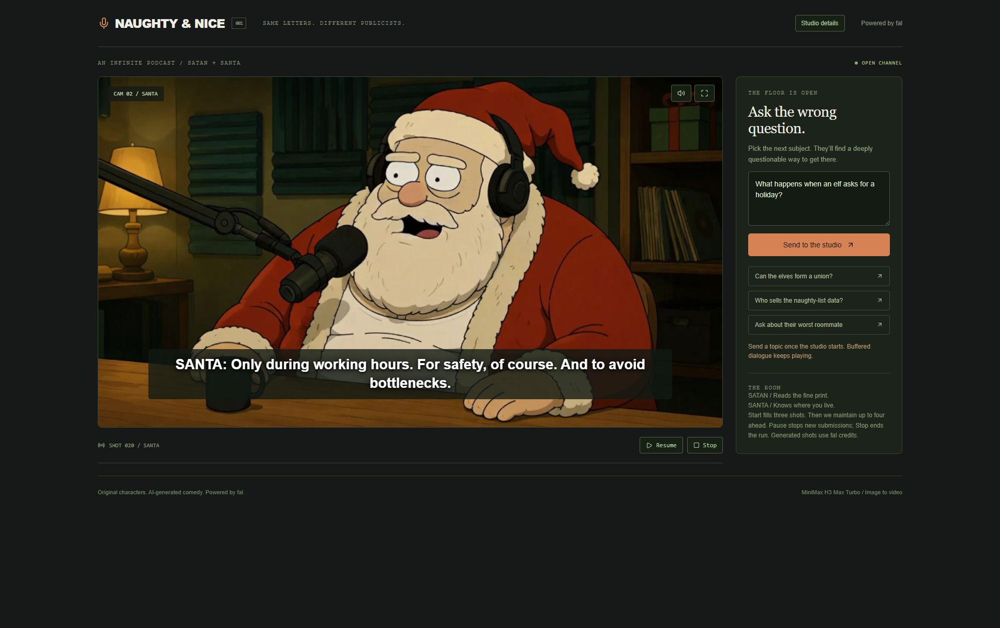

# Pepe & Chad Live

An infinite crypto-meme podcast that reacts to the timeline. Pepe and GigaChad keep talking, pull in what is happening right now on X, and take a questionable turn into whatever the audience asks about.

Built with [fal](https://fal.ai): MiniMax H3 Max Turbo generates each speaking shot from a character image, while Gemini writes the next exchange. Topics come from two lanes: free Google News RSS for tech and macro stories, and the local [Grok CLI](https://x.ai) for what crypto voices are posting on X.


## How it works

- Two fixed camera angles, generated speech, and short 5-7 second turns.
- The crypto desk searches X for what named memecoin and Solana accounts are posting, and the hosts riff on their takes.
- A free news lane fills the gaps from Google News, airing a story only when three outlets carry it.
- Pasted live-chat comments are ranked locally and queued as topics; real platform adapters plug into the same interface.
- Three clips buffered before playback, with up to four upcoming shots prepared ahead.
- Audience prompts steer the next unwritten exchange without cutting off a speaker.
- Pause, resume, fullscreen, captions, and an optional studio details panel.



## Run locally

Requires Node.js 22.13+ and a [fal API key](https://fal.ai/dashboard/keys). The crypto desk additionally needs the Grok CLI signed in (`grok login`); without it the show still runs on free news and audience prompts.

```sh
npm install
cp .dev.vars.example .dev.vars
# Set FAL_KEY in .dev.vars
npm run dev -- --host 127.0.0.1 --port 3212
```

On PowerShell, use `Copy-Item .dev.vars.example .dev.vars` instead of `cp`.

Open [localhost:3212](http://localhost:3212) and select **Tune in**. Generation uses your fal credits. The key stays on the server.

## Under the hood

React, TypeScript, Vinext, and a local Cloudflare Workers runtime. Character images are generated once, then reused for image-to-video. Edit `lib/show.ts` to change the cast, opening, voices, and writing direction.

Regenerate the character stills with `node scripts/characters.mjs` (uses fal credits, about $0.15 per image). Use `--dry-run` to see the prompts, `--variants 2` to compare candidates, and `--pick host=0 --pick guest=1` to promote them.

`npm run dev` starts the app and the crypto desk together. The desk (`scripts/newsdesk.mjs`) is a loopback-only wrapper around the Grok CLI, which the Cloudflare Workers runtime cannot launch itself; it runs one call at a time and reports its spend at `127.0.0.1:8791/health`. Topic selection lives in `lib/topics.ts`, the free news lane in `lib/gnews.ts`, and the desk prompts in `lib/newsdesk.ts`. Set `NEWSDESK_X_HANDLES` to change the watchlist, or `NEWSDESK_MAX_PER_HOUR` / `NEWSDESK_MAX_SPEND_USD` to cap the desk.

Generation is the real cost: continuous airtime runs roughly $22 per hour at MiniMax promotional pricing and about $90 per hour at list price. The crypto desk draws on your Grok subscription at roughly $0.04-0.15 a call, a few calls an hour; the news lane is free.

The buffer smooths playback but adds a delay to audience requests. Generation can still stall or be rejected. Captions show the script; generated speech and voices can vary. Stop ends new submissions, while jobs already sent may finish. Reloading clears the session.

## Checks

```sh
node --test tests/engine.test.mjs tests/topics.test.mjs tests/gnews.test.mjs
npx tsc --noEmit
npx oxlint app lib scripts components/player.tsx components/ticker.tsx components/wire.tsx components/feed-panel.tsx
npm run build
```

Pepe the Frog and GigaChad are internet meme characters used here as parody; Pepe was created by Matt Furie and this project is unaffiliated with him or with the model GigaChad derives from. The show comments on the public posts of real, named people; it is satire of those public takes and nothing else. AI-generated comedy, not financial advice. Live topics are summaries of public reporting and can be wrong. This repository is a local demo, not a hosted multi-user service.
